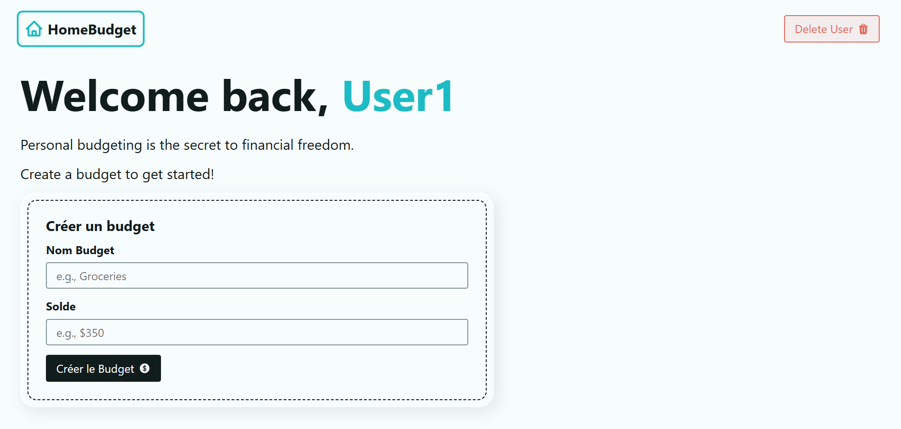
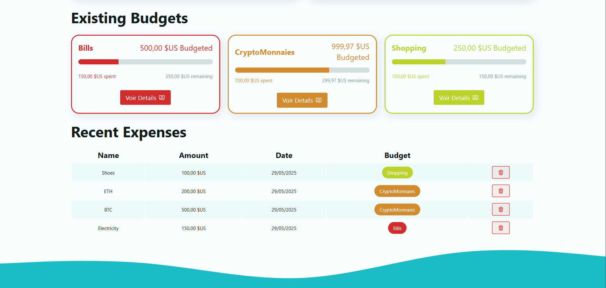
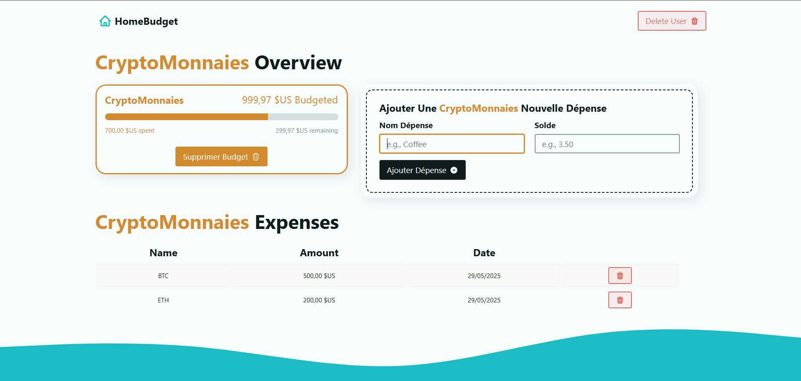

# 💸 ReactBudgetProject [Français 🇫🇷](#francais) | [English 🇬🇧](#english)

---

## 📸 Capture 

### 🏠 Landing Page


---
###  Dashoboard Page / Page Accueil

<div align="center">
  <table>
    <tr>
      <td></td>
    </tr>
    <tr>
      <td align="center">First Dashboard Page/Premier Vue Dashboard</td>
    </tr>
    <tr>
      <br/>
    </tr>
    <tr>
      <td></td>
    </tr>
    <tr>
      <td align="center">Dashboard Page with Budget </td>
    </tr>
  </table>
</div>

---

### 📚 Budget Details Page / Page Details Budget

<div align="center">
  
  <p>Recherche via une liste prédéfinie</p>
</div>

---

## Francais

### 📘 Présentation

**ReactBudgetProject** est une application de gestion de budget personnel construite avec **React.js** via **Vite**. Elle permet à un utilisateur d’ajouter des budgets, de suivre ses dépenses et de voir son solde restant en temps réel.

---

### 🛠️ Prérequis

- [Node.js](https://nodejs.org/fr/) (v14 ou supérieur)
- npm (ou yarn)
---

### 🚀 Installation & Lancement

```bash
git clone https://github.com/MrSalifDiallo/ReactBudgetProject.git
cd ReactBudgetProject
npm install
npm run dev
```
Fixer les vulnérabilités
```bash
npm audit fix
```
Ou
```bash
npm audit fix --Force 
```

### 📁 Structure du projet
Voici l'arborescence complète :

````
ReactBudgetProject/
├── node_modules/              # Dépendances installées automatiquement
├── public/
│   └── vite.svg               # Logo Vite par défaut
├── src/
│   ├── assets/                # Fichiers statiques (logo, icônes, etc.)
│   │   └── react.svg
│   ├── components/            # Composants réutilisables de l'app
│   │   ├── BudgetDisplay.jsx
│   │   ├── BudgetForm.jsx
│   │   ├── ExpenseForm.jsx
│   │   ├── ExpenseList.jsx
│   │   └── Header.jsx
│   ├── App.css                # Feuille de style principale
│   ├── App.jsx                # Composant racine
│   └── main.jsx               # Point d’entrée React + Vite
├── .gitignore                 # Fichiers/dossiers ignorés par Git
├── index.html                 # Fichier HTML principal
├── package-lock.json          # Verrouillage des dépendances npm
├── package.json               # Définition du projet et des scripts
├── README.md                  # Ce fichier de documentation
└── vite.config.js             # Configuration de Vite
````

### 💡Contribution

1. Fork le projet
2. Créer une branche pour votre fonctionnalité (`git checkout -b feature/AmazingFeature`)
3. Commit vos changements (`git commit -m 'Add some AmazingFeature'`)
4. Push vers la branche (`git push origin feature/AmazingFeature`)
5. Ouvrir une Pull Request

### 👤 Auteur

**Salif Diallo**  
💼 Développeur && passionné par les solutions de gestion,Finance and Cryptomonnaies
📧 [salifdiallo@esp.sn](mailto:salifdiallo@esp.sn)  
🔗 [GitHub - MrSalifDiallo](https://github.com/MrSalifDiallo)  
🌍 Basé à Dakar, Sénégal

---

## English

### 📘 Overview

**ReactBudgetProject** is a personal budget management application built with **React.js** using **Vite**. It allows users to add budgets, track expenses, and view their remaining balance in real-time.

---

### 🛠️ Prerequisites

* [Node.js](https://nodejs.org/) (v14 or higher)
* npm (or yarn)

---

### 🚀 Installation & Launch

```bash
git clone https://github.com/MrSalifDiallo/ReactBudgetProject.git
cd ReactBudgetProject
npm install
npm run dev
```

Fix vulnerabilities:

```bash
npm audit fix
```

Or (force fix):

```bash
npm audit fix --force
```

---

### 📁 Project Structure

Here is the full directory structure:

```bash
ReactBudgetProject/
├── node_modules/              # Automatically installed dependencies
├── public/
│   └── vite.svg               # Default Vite logo
├── src/
│   ├── assets/                # Static files (logo, icons, etc.)
│   │   └── react.svg
│   ├── components/            # Reusable UI components
│   │   ├── BudgetDisplay.jsx
│   │   ├── BudgetForm.jsx
│   │   ├── ExpenseForm.jsx
│   │   ├── ExpenseList.jsx
│   │   └── Header.jsx
│   ├── App.css                # Main stylesheet
│   ├── App.jsx                # Root component
│   └── main.jsx               # React + Vite entry point
├── .gitignore                 # Git ignored files
├── index.html                 # Main HTML file
├── package-lock.json          # Dependency lock file
├── package.json               # Project metadata & scripts
├── README.md                  # This documentation file
└── vite.config.js             # Vite configuration
```

---

### 💡 Contributing

1. Fork the repository
2. Create a new branch (`git checkout -b feature/AmazingFeature`)
3. Commit your changes (`git commit -m 'Add some AmazingFeature'`)
4. Push to your branch (`git push origin feature/AmazingFeature`)
5. Open a Pull Request

---

### 👤 Author

**Salif Diallo**
💼 Developer & passionate about management solutions, finance, and cryptocurrencies
📧 [salifdiallo@esp.sn](mailto:salifdiallo@esp.sn)
🔗 [GitHub - MrSalifDiallo](https://github.com/MrSalifDiallo)
🌍 Based in Dakar, Senegal

---
